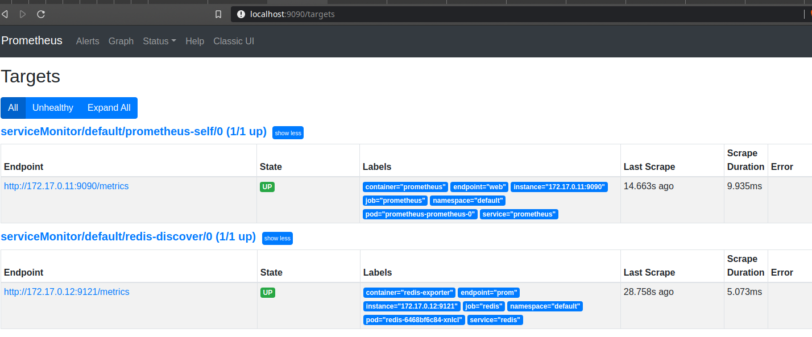

# Prometheus Operator

## Setup Environment

Install the Operator:

```bash
kubectl apply -f https://raw.githubusercontent.com/prometheus-operator/prometheus-operator/master/bundle.yaml
```
Create service account:

```bash
kubectl create -f prom_rbac.yaml
```
Setup Prometheus and Prometheus service:

```bash
kubectl create -f prometheus.yaml
```

```bash
kubectl create -f prom_svc.yaml
```

Create single service monitor for Prometheus:

```bash
kubectl apply -f prometheus_servicemonitor.yaml
```
Now we have our prometheus self monitoring.

## Monitoring applications

Lets setup a Redis instance with prometheus exporter:

```bash
 kubectl apply -f redis_prometheus_exporter.yaml 
```
The Redis service needs to be the correct label:

```yaml
kind: Service
apiVersion: v1
metadata:
  name: redis
  labels:
    app: redis
```
Then, setup the service monitor for redis:

```bash
 kubectl apply -f redis_servicemonitor.yaml 
```

Automatic we have all Redis instances monitored (matching label app: redis).

